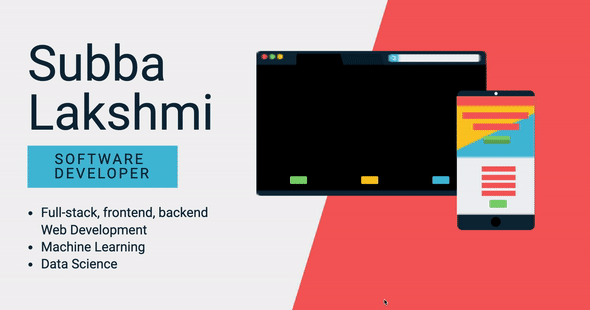

### Hi there 👋

- 🔭 I’m currently working at [University of Texas Rio Grande Valley](https://www.utrgv.edu/en-us/) as Software Engineer. 🥑
- 🌱 I’m currently improving my Deep Learning skills and pursuing Masters of Science in Computer Science at [UTRGV](https://www.utrgv.edu/en-us/).
- 👯 I’m looking to collaborate on open source, web development, app development and machine learning projects.
- 🤔 I’m looking for help with Docker containers.
- 💬 Ask me about Full Stack Engineering, Machine Learning and Computer Science.
- 📫 How to reach me: Find me on [LinkedIn](https://www.linkedin.com/in/subbalakshmim/) [Medium](http://subba-lakshmi.medium.com) or [Twitter](https://twitter.com/subbalakshmi___), or go check my own [website](https://www.linkedin.com/in/subbalakshmim/)
- 😄 Pronouns: She/Her
- ⚡ Fun fact: I can eat a lot of tacos, like, really a lot. 🌮🌮🌮

---

### Coding stats 🔥

<!--START_SECTION:waka-->
```text
Python        █████████████████████████   100.00 % 

Java          █████████████████████████   100.00 % 

C#            ██████████████████████      80.00 % 
```
<!--END_SECTION:waka-->
